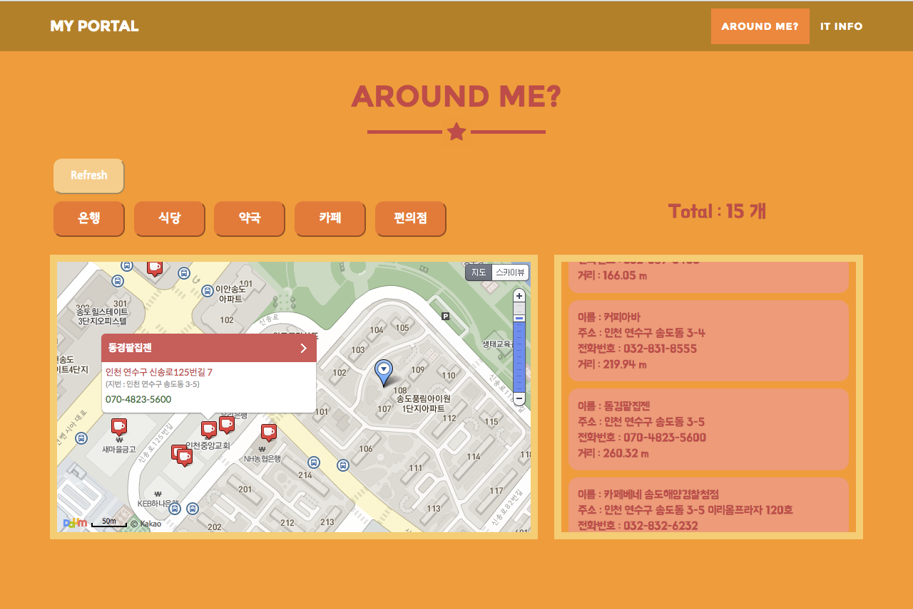
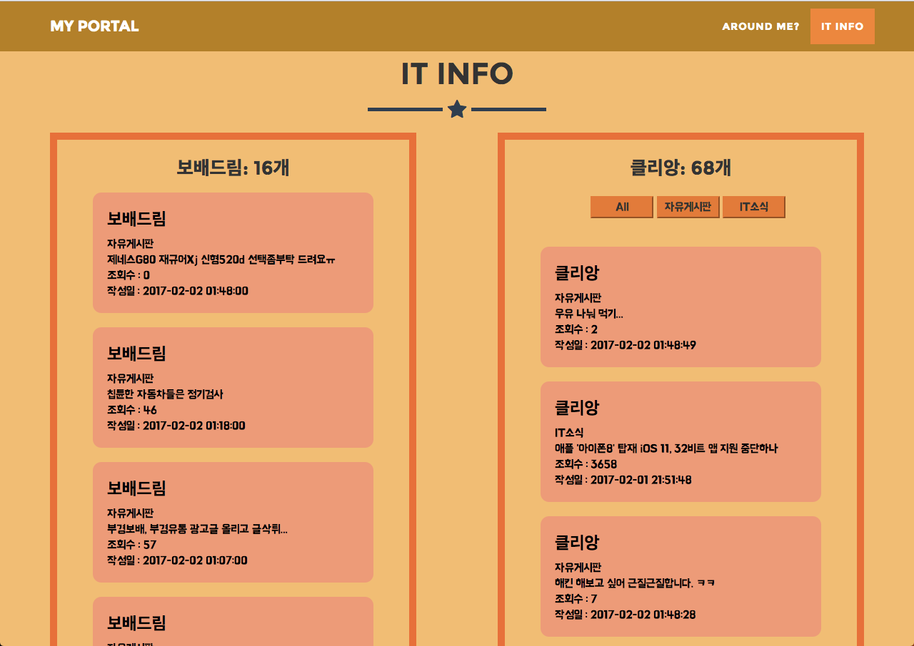

My Simple Web Portal
=============

Main Page
-------------

Around Me
-------------
If you click that store information, the corresponding shop location appears on the map.

IT info
-------------
Each minute brings forth the latest posting on the site.
Similarly, you can view the original content by clicking on the corresponding postings.

Scrapy Setting
=============
Crontab Setting
-------------
1. 터미널에서 EDITOR=vim crontab -e 실행
2. 다음 Code 작성
<pre><codei>
MAILTO = '' // 해당 예약어 수행 결과를 받아보려면 해당 계정이름을 적어줌
PATH=/usr/local/bin
LC_CTYPE="utf-8" // 한글 인코딩 문제
* * * * * * cd crawling folder 절대 경로 && scrapy crawl community
// 매 분 실행. 앞의 * 로 crontab 실행 빈도를 결정해준다.
</code></pre>
3. 완료

Database Setting
-------------
1. databse / createDB.sql 로 테이블 및 데이터 베이스 생성
2. crawling / pipeline.py 에서 환경에 맞게 변수 세팅
3. 완료

API Setting
=============
1. index.php 의 DAUM , NAVER API KEY 적용
2. 완료

